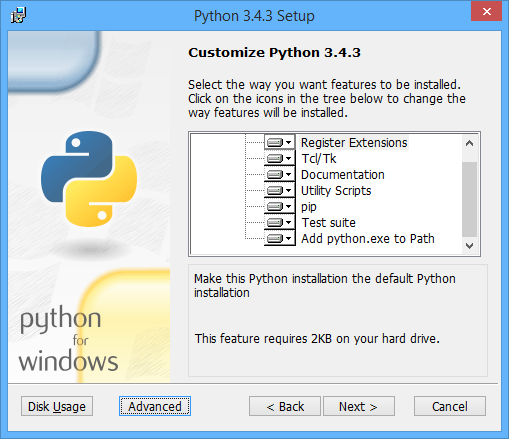

====================
 Pyramid TODO app
====================

Setup
====================

Install Python
--------------------

Windows
~~~~~~~~~~~~~~~~~~~~

Open a command prompt and type ``python --version``. You should see something like this::

    C:\Users\Me>python --version
    Python 3.4.3

If you do not have Python 3.4 installed, download the Windows installer from `python.org
<http://www.python.org/>`_

When you are running the Windows installer, make sure to select "Register Extensions" and "Add python.exe to the Path". Note that this will change the default Python on your system to Python 3.4.

After you have installed Python 3.4, open a new command prompt and type ``python --version``. You should now see that Python is installed and ready.

On Windows 8 and 8.1, there is a quick keyboard shortcut for opening a new command prompt - Win-x, then c.

The regular Windows command prompt (``cmd.exe``) will work fine for this class, but if you want a nicer command line interface, I recommend `cmder <http://gooseberrycreative.com/cmder/>`_. It looks better, and has some useful extras.

Pip
~~~~~~~~~~~~~~~~~~~~

Python comes with a package manager called ``pip``. This is used to automatically install the dependencies for a project, usually from the `Python Package Index <https://pypi.python.org/pypi>`_. The Python Package Index is abbreviated PyPI, and is affectionately known as the "Cheeseshop".

Run this at the command line::

    pip --version

If you get a "not recognized" error, re-install Python and make sure to choose the installer option to add Python to the path.

The current version of pip as of this writing (2015-05-04) is 6.1.1. If ``pip --version`` is older than that, here's how to upgrade.::

    python -m pip install --upgrade pip

Virtualenv
~~~~~~~~~~~~~~~~~~~~

We will be using virtual environments to isolate the projects we are working on. The advantage of using virtual environments is that we can work on multiple projects, and not have their dependencies interfere with each other. For example, we can work on a Django 1.6 project and a Django 1.7 project side by side, without conflicts.

First, let's install virtualenv sitewide.::

    pip install virtualenv

Virtualenv needs a place to store the virtual environments. Make a new folder at ``C:\PythonEnvs``.

Let's make our first virtualenv::

    virtualenv C:\PythonEnvs\my_virtual_env

The output should look like this.::

    Using base prefix 'C:\\Python34'
    New python executable in C:\PythonEnvs\my_virtual_env\Scripts\python.exe
    Installing setuptools, pip...done.

Now our virtualenv has been created, but has not yet been activated. When a virtualenv is activated, only the packages installed in that virtualenv are available to the Python interpreter.

::

    C:\Users\Me>C:\PythonEnvs\my_virtual_env\Scripts\activate.bat
    (my_virtual_env)C:\Users\Me>

Our virtualenv has been created, and is now active. Notice that the command prompt has changed; the name of the virtualenv is displayed in parentheses.

On Windows, you can use the ``where`` utility to see the full path to executables that you run. With the virtualenv activated, type::

    where python

You should see::

    C:\PythonEnvs\pyramid-class\Scripts\python.exe
    C:\Python34\python.exe

The ``python.exe`` from our virtualenv is the first one listed. Now, deactivate the virtualenv, and try running ``where`` again.::

    deactivate
    where python

It should look like this::

    (my_virtual_env)C:\Users\Me>deactivate
    C:\Users\Me>where python
    C:\Python34\python.exe

Notice that when the virtualenv is not active, its copy of ``python.exe`` is not in the path. Path manipulation is how virtualenv does its work.

Pip again
~~~~~~~~~~~~~~~~~~~~

Let's use pip to see what packages are available in the Virtualenv.::

    pip list

results in::

    pip (6.1.1)
    setuptools (12.0.5)
    virtualenv (12.1.1)

Let's install something in to our virtualenv.::

    pip install pyramid

Pip downloads Pyramid from PyPI, and it looks for a list of the packages that Pyramid requires. It then downloads those packages, and all of their requirements, recursively. It then installs each package in to the virtualenv.

Look at what was installed::

    pip list

should look like this::

    PasteDeploy (1.5.2)
    pip (6.1.1)
    pyramid (1.5.7)
    repoze.lru (0.6)
    setuptools (15.2)
    translationstring (1.3)
    venusian (1.0)
    WebOb (1.4.1)
    zope.deprecation (4.1.2)
    zope.interface (4.1.2)

The version numbers of the installed packages may differ from what is shown here.

Virtualenvwrapper
~~~~~~~~~~~~~~~~~~~~

Git
~~~~~~~~~~~~~~~~~~~~

Next steps
~~~~~~~~~~~~~~~~~~~~

Now that we have Pyramid installed in a virtualenv, we can get started on writing our first Pyramid app.
